# accountActivate
备注：展示还没有找到如何激活（出现）这个页面

# bindShop.jsp
内容：商家绑定

# exchange.jsp
My account -> submit -> Newly released

# fail.jsp
备注：展示还没有找到如何激活（出现）这个页面

# header.jsp
```html
<div class="logo">
```

```html
        <li><a href="index.jsp">Homepage</a></li>
        <li><a href="reference.jsp">Reference price</a></li>
        <li><a href="/bonusPointsExchange/QueryLatestOrder">Newly released</a></li>
        <li><a href="/bonusPointsExchange/actionServlet?actionCode=bindShop&methodCode=find_bindedShops">Initiate transaction</a></li>
```
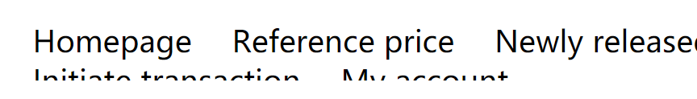
# Index.jsp
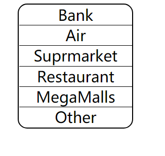
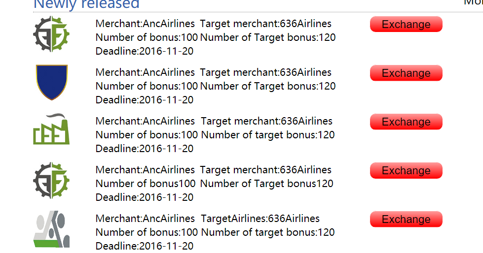
# order.png
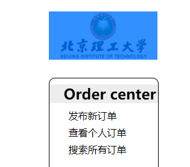
# regist_shop.jsp
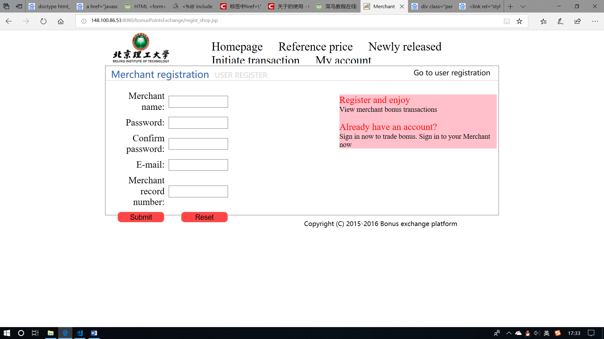
# recommend.jsp
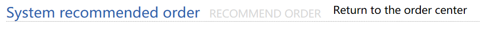
# personalv1.0
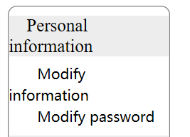
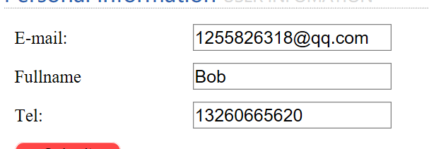
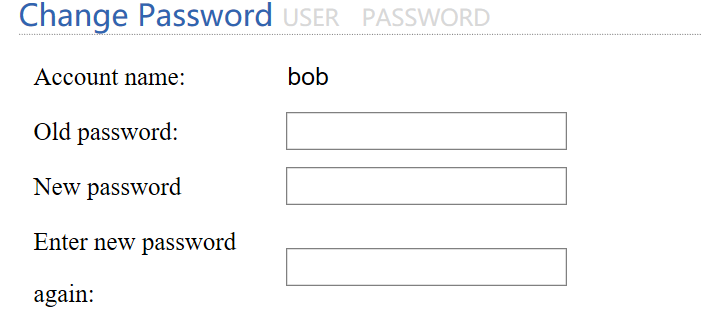
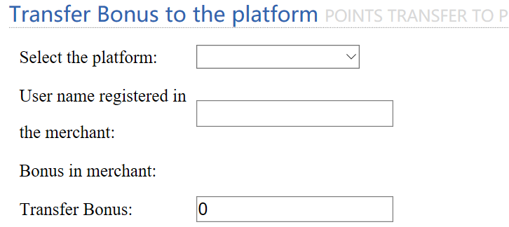
# reference.jsp
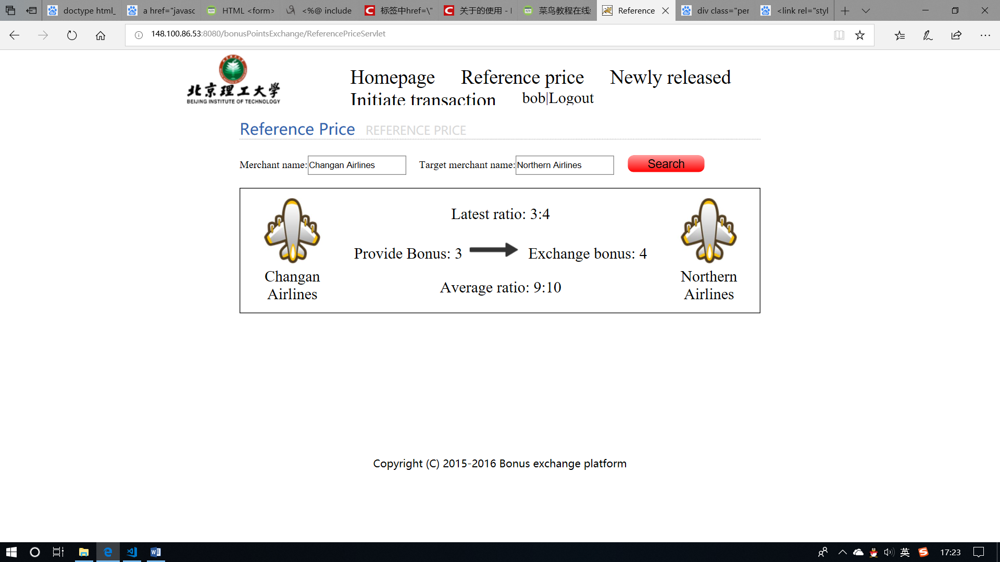